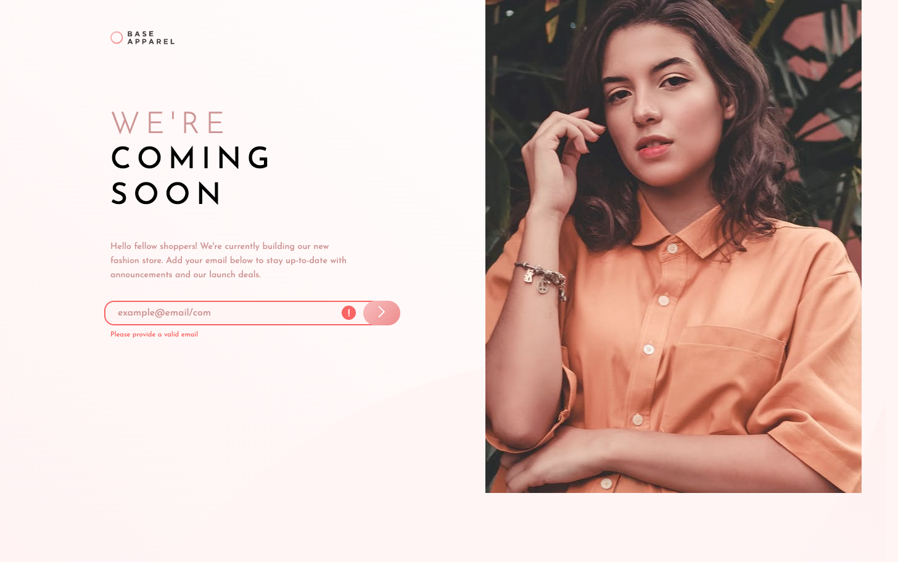

# Frontend Mentor - Base Apparel coming soon page solution

This is a solution to the [Base Apparel coming soon page challenge on Frontend Mentor](https://www.frontendmentor.io/challenges/base-apparel-coming-soon-page-5d46b47f8db8a7063f9331a0).

## Table of contents

- [Overview](#overview)
- [Goal](#goal)
- [Outcome](#outcome)
- [Process](#process)
- [Built with](#built-with)
<!-- - [Feedback](#feedback) -->
- [Lessons](#lessons)
- [Development](#development)
- [Useful resources](#useful-resources)

## Overview

This challenge involves some client-side validation using a formatting and empty field check. I'm well-versed in these now. There is also a Flex layout I'll need to pay attention to.

## Goal

My goal here is to focus on making the layout responsive effectively.

## Outcome

:jigsaw: [Live Site URL](https://i000o.github.io/base-apparel-coming-soon/)  
:pencil2: [Solution URL](https://www.frontendmentor.io/solutions/responsive-layout-using-flex-with-js-form-validation-_6z6OY4wi5)

## Built with

- Semantic HTML5 markup
- CSS
- Desktop-first workflow
- Sass

## Process

- I found this layout difficult. Minimal JavaScript, which was doable and I learnt new techniques listed in [Lessons](#lessons). I also implemented a few conditional statements, which was good practice.
- The layout itself... maybe I should've used Grid. With the `art direction` technique of swapping the hero image out according to viewport size, and the splitting of the content down the centre, as well as the change from `flex-direction: column;` on mobile to `row` on desktop, it just got finnicky at some point. I think I've done pretty well considering, although it took me a long time to perfect and it's still not 100% there.
- I still find `background-image` hard to work with. I want to find more resources to help with this because I think it's holding me back from great designs.
- I'm not sure why the content isn't taking the full height of the viewport on desktop, maybe had I used Grid this would've been easier to achieve. I have `height: 100svh;` on my tablet-sized media queries and up so I'm not sure why it doesn't take.

## Time taken

This took me a lot longer than I would've wanted. I hope to be able to anticipate better pesky layouts that will be difficult to work with unless I understand its implications at the beginning of the process rather than discovering it as I go on. The JavaScript didn't take me long at all - it was the layout that got me.

<!-- ## Feedback -->

## Lessons

1. `classList` in Javascript as a built-in object which checks for a list of classes declared in the HTML for that element.
2. Descendant Combinators vs. Compound Selector - `span .error` vs. `span.error`: The first targets a _descendant_ of span, while the second targets `` with the class of `error`.
3. Used the `<picture>` element again after a long time to swap out a mobile hero image for a desktop one in media queries. Good to try this again - very useful.
4. The importance of the order of the `<source>` list. Browser will check the rules from the top down.
5. `display: contents;` excludes the element from the inheritance stack, so that its children become children of its parent instead.

## Development

- I want to really try to spot Grid layouts when I see them better. I could save myself so much time if I was more instinctive with them. But I've learnt a lot from this one.

# base-apparel-coming-soon
